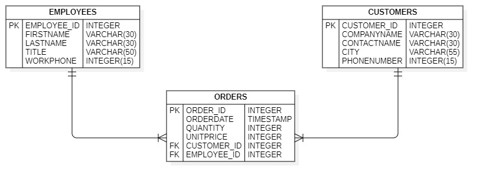

# MyOrders-Backend App

In this project we create a basic command manager in Spring Boot, even how to create the project in Angular and be able to do all the operations of CRUD API Rest.

### Preview Entity–relationship model DB

